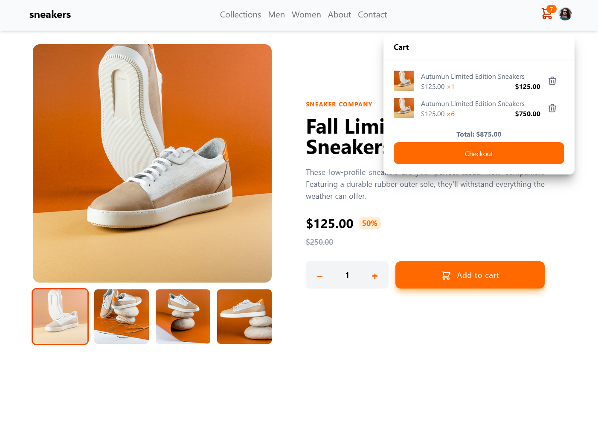
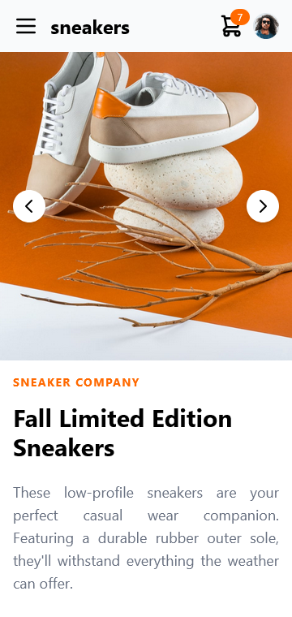

# Interactive Product Page

[**Открыть онлайн**](https://try-again-later.github.io/Interactive-Product-Page/)

Интерактивная страница товара из интернет-магазина, созданная с помощью [TailwindCSS](https://tailwindcss.com/) и [AlpineJS](https://alpinejs.dev/).
Кнопка покупки товара и поп-ап для корзины сделаны интерактивными.
Страница адаптирована как под десктоп, так и под мобильные девайсы.

---

[**Live version**](https://try-again-later.github.io/Interactive-Product-Page/)

An interactive product page for an online store made with [TailwindCSS](https://tailwindcss.com/) and [AlpineJS](https://alpinejs.dev/).
The purchase button and the cart pop-up are actually clickable and interactive.
The page is adapted both for desktop and mobile devices.

## Run locally

```sh
npm run dev
```

The project will be available at [localhost:5173/Interactive-Product-Page](http://localhost:5173/Interactive-Product-Page/).

## Build

```sh
npm run build
```

Generated files will be available under the `dist` folder.

## Screenshots

 
